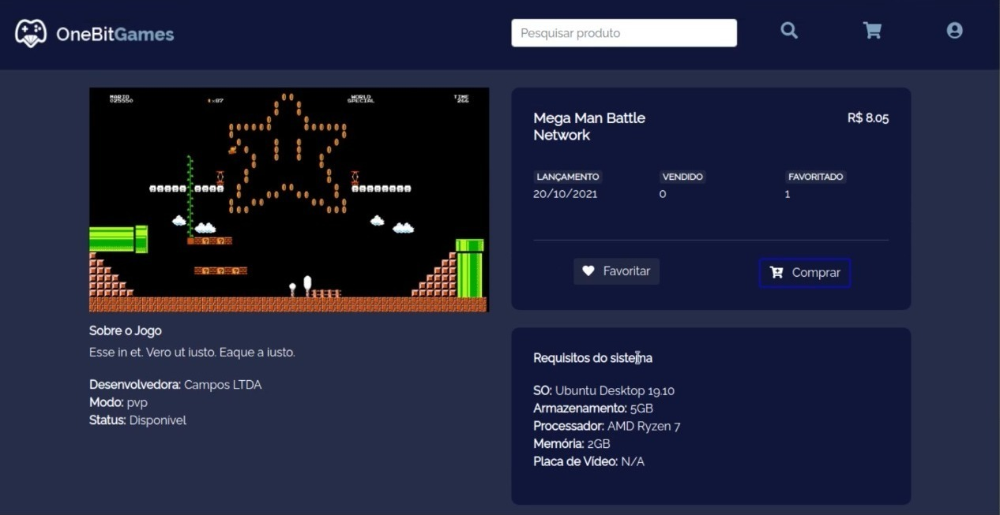

# Ecommerce FrontEnd
Ecommerce Frontend made using [next.js](https://nextjs.org/)




BackEnd: [https://github.com/gabriel-del/e-commerce-Api-Dev](https://github.com/gabriel-del/e-commerce-Api-Dev)


## Run
```bash
yarn install
yarn dev
```

## Learn Javascript Fullstack 

<p align="center">
<a href="https://go.hotmart.com/P66380356P">

</a>
</p>
